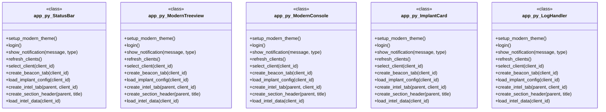

# Polyglot Codebase Knowledge Graph

> Generated offline by **readmenator**. 7 files, 94 symbols, 48 imports. Supports C, C++, Python, Go, Rust, JS/TS, Java, C#, Shell, PHP, Dart, GDScript, Nim, ASM, Ruby, Swift, Kotlin, Scala, Lua, Elixir.
> No LLMs. No tokens. Pure static analysis. See more [here](https://github.com/grisuno/ReadMenator)

**Start here:** Statistics Dashboard for scope, God Nodes for blast radius, Architecture Reference for per-file API. Agents: prefer `readmenator-agent/INDEX.md` + `SYMBOLS.md`.

**Wiki:** prefer `readmenator-wiki/index.md` for progressive disclosure: one synthesis page per community, `connections.json` with EXTRACTED vs INFERRED confidence, `queries.md` log, `REPORT.md` audit.

**Confidence:** EXTRACTED = parsed from source, INFERRED = heuristic bridge, AMBIGUOUS = reported, never hidden. See `readmenator-wiki/REPORT.md`.

**Total Files Parsed:** 7 | **Total Symbols Extracted:** 94 | **Total Imports:** 48

<!-- ranking_model: v1.0 | weights: {ppr:0.45,auth:0.2,test:0.15,doc:0.1,fresh:0.1} | alpha:0.85 | commit:b3ca3bb | date:2026-07-18 -->


## Table of Contents

1. [Statistics Dashboard](#statistics-dashboard)
2. [Architectural Layers](#architectural-layers)
3. [Ranked Context](#ranked-context)
4. [God Nodes](#god-nodes)
5. [Suggested Questions](#suggested-questions)
6. [Taint Propagation Map](#taint-propagation-map)
7. [Hotspot Analysis](#hotspot-analysis)
8. [Change Impact Analysis](#change-impact-analysis)
9. [Suggested Linting Rules](#suggested-linting-rules)
10. [Dataflow Analysis](#dataflow-analysis)
11. [Orphans](#orphans)
12. [Query Recipes](#query-recipes)
13. [Structural Knowledge Map](#structural-knowledge-map)
14. [UML Class Diagram](#uml-class-diagram)
15. [Code Property Graph](#code-property-graph)
16. [Architecture Reference](#architecture-reference)
    - [GO (4 files)](#go-4-files)
    - [JS (1 files)](#js-1-files)
    - [PY (1 files)](#py-1-files)
    - [SH (1 files)](#sh-1-files)

---

## Statistics Dashboard

| Metric | Value |
|--------|-------|
| Total Files | 7 |
| Total Symbols | 94 |
| Total Imports | 48 |
| Call Edges | 845 |
| Inheritance Edges | 5 |
| Languages | 4 |
| Avg Symbols/File | 13.4 |
| Avg Imports/File | 6.9 |

### Top Files by Import Count (Fan-Out)

| File | Imports | Symbols | Language |
|------|---------|---------|----------|
| `app.py` | 17 | 72 | py |
| `handlers.go` | 14 | 13 | go |
| `crypto.go` | 8 | 3 | go |
| `main.go` | 7 | 1 | go |
| `schemas.go` | 2 | 1 | go |

---

## Architectural Layers

Auto-detected from path patterns, naming conventions, and imported frameworks.

| Layer | Files |
|-------|-------|
| utility | 6 |
| presentation | 1 |

### utility

- `app.py` (py, 72 symbols)
- `crypto.go` (go, 3 symbols)
- `install.sh` (sh, 0 symbols)
- `main.go` (go, 1 symbols)
- `schemas.go` (go, 1 symbols)
- `dashboard.js` (js, 4 symbols)

### presentation

- `handlers.go` (go, 13 symbols)

---

## Ranked Context

Files ranked by composite score for the current query context. The ranking combines Personalized PageRank (query relevance), global authority, test coverage, documentation coverage, and code freshness. Model: v1.0.

| Rank | File | Composite | PPR | Authority | Test | Doc |
|------|------|-----------|-----|-----------|------|-----|
| 1 | `crypto.go` | 0.1000 | 0.0000 | 0.0000 | 0.00 | 1.00 |
| 2 | `schemas.go` | 0.1000 | 0.0000 | 0.0000 | 0.00 | 1.00 |
| 3 | `app.py` | 0.0375 | 0.0000 | 0.0000 | 0.00 | 0.38 |
| 4 | `handlers.go` | 0.0308 | 0.0000 | 0.0000 | 0.00 | 0.31 |
| 5 | `install.sh` | 0.0000 | 0.0000 | 0.0000 | 0.00 | 0.00 |
| 6 | `main.go` | 0.0000 | 0.0000 | 0.0000 | 0.00 | 0.00 |
| 7 | `dashboard.js` | 0.0000 | 0.0000 | 0.0000 | 0.00 | 0.00 |

---

## God Nodes

Most architecturally central files ranked by combined import/export degree and symbol richness.

| File | Score | Connections | PageRank |
|------|-------|-------------|----------|
| `app.py` | 7.2 | | 0.0000 |
| `handlers.go` | 1.3 | | 0.0000 |
| `dashboard.js` | 0.4 | | 0.0000 |
| `crypto.go` | 0.3 | | 0.0000 |
| `main.go` | 0.1 | | 0.0000 |
| `schemas.go` | 0.1 | | 0.0000 |
| `install.sh` | 0.0 | | 0.0000 |

---

## Suggested Questions

Auto-generated exploration prompts based on graph structure:

- What does app.py depend on, and what depends on it? (0 connections)
- What does handlers.go depend on, and what depends on it? (0 connections)
- What does dashboard.js depend on, and what depends on it? (0 connections)
- What is StatusBar in app.py and how is it used?
- What is the overall architecture of this codebase?

---

## Taint Propagation Map

Taint analysis traces how dangerous imports propagate through the codebase via transitive dependencies. Source files import dangerous modules directly; sink files receive the danger indirectly.

**Taint Sources:** 1 | **Taint Sinks:** 1 | **Propagation Paths:** 1

- `app.py` imports `requests` (0 hop to `app.py`) [medium]
  Path: app.py

---

## Hotspot Analysis

Files ranked by combined complexity (symbol count) and centrality (connection count). High-scoring files are architecturally critical and may need refactoring attention.

| File | Complexity | Centrality | Combined | Symbols | Connections |
|------|-----------|------------|----------|---------|-------------|
| `crypto.go` | 0.042 | 0.333 | 0.217 | 3 | 8 |
| `schemas.go` | 0.014 | 0.083 | 0.056 | 1 | 2 |
| `app.py` | 1.000 | 0.708 | 0.825 | 72 | 17 |
| `handlers.go` | 0.181 | 0.583 | 0.422 | 13 | 14 |
| `install.sh` | 0.000 | 0.000 | 0.000 | 0 | 0 |
| `main.go` | 0.014 | 0.292 | 0.181 | 1 | 7 |
| `dashboard.js` | 0.056 | 1.000 | 0.622 | 4 | 24 |

---

## Dataflow Analysis

Procedural intra-function dataflow findings (zero tokens, regex-based heuristics, all INFERRED). Each lead is grounded at file:line for manual review.

**1 findings** (UNCHECKED_ALLOC: 1).

| File | Function | Line | Kind | Variable | Description |
|------|----------|------|------|----------|-------------|
| `app.py` | `load_os_image` | 590 | `UNCHECKED_ALLOC` | `img` | Result of allocator stored in `img` is never checked against NULL. |

---

## Change Impact Analysis

Files sorted by how many other files would be affected if they changed. High-impact files should be changed with caution.

| File | Direct Dependents | Transitive Dependents | Total Impact |
|------|------------------|----------------------|--------------|
| `app.py` | 0 | 0 | 0 |
| `crypto.go` | 0 | 0 | 0 |
| `handlers.go` | 0 | 0 | 0 |
| `install.sh` | 0 | 0 | 0 |
| `main.go` | 0 | 0 | 0 |
| `schemas.go` | 0 | 0 | 0 |
| `dashboard.js` | 0 | 0 | 0 |

---

## Suggested Linting Rules

Automatically suggested linting and security rules based on patterns detected in the codebase. These can be exported as Semgrep rules using the `--export-rules` flag.

| Rule ID | Severity | Description | Language | Matches |
|---------|----------|-------------|----------|---------|
| `RM001` | info | Large number of functions in py: 67 total | py | 67 |
| `RM002` | info | Large number of functions in go: 18 total | go | 18 |
| `RM003` | info | Large number of functions in js: 4 total | js | 4 |
| `RM004` | info | Print statement found (consider logging instead) | python | 12 |

---

## Orphans

Files with no documentation or low connectivity. These are candidates for documentation investment or cleanup.

- `install.sh` (0 symbols, no doc)
- `main.go` (1 symbols, no doc)
- `dashboard.js` (4 symbols, no doc)

---

## Query Recipes

Example queries you can run against this knowledge base using the ranking engine:

```
# Find files most relevant to a concept
readmenator query "Where is the import resolver implemented?"

# Rank files by relevance to a topic
readmenator query "How does documentation generation work?"

# Explain why a file ranks highly
readmenator query "explain readmenator/_documentation.py"

# Trace dependency paths with ranked context
readmenator query "path from CLI to exporter"
```

The ranking model uses the following signals:

- **Personalized PageRank** (45% weight): query-specific relevance via seed propagation
- **Global Authority** (20% weight): structural importance via standard PageRank
- **Test Coverage** (15% weight): fraction of symbols referenced in test files
- **Doc Coverage** (10% weight): presence of docstrings and file-level docs
- **Freshness** (10% weight): recent modification activity

Results include score decomposition and justification paths for each ranked item.

---

## Structural Knowledge Map


---

## UML Class Diagram

Auto-generated Mermaid class diagram from parsed class-level symbols. Shows classes, structs, interfaces, traits, and their methods with inheritance and dependency relationships.



---

## Code Property Graph

Machine-readable Code Property Graph (CPG) in JSON-LD format. This block allows AI agents to parse the full structural graph without additional file reads. Compatible with GraphRAG pipelines.

```json
{"@context": "https://schema.org", "analysis": {"communities": [], "god_nodes": [{"node_id": "app.py", "score": 7.2}, {"node_id": "handlers.go", "score": 1.3}, {"node_id": "web/js/dashboard.js", "score": 0.4}, {"node_id": "crypto.go", "score": 0.3}, {"node_id": "main.go", "score": 0.1}, {"node_id": "schemas.go", "score": 0.1}, {"node_id": "install.sh", "score": 0.0}], "surprising_connections": []}, "edges": [{"confidence": "EXTRACTED", "relation": "imports", "source": "app.py", "target": "tkinter"}, {"confidence": "EXTRACTED", "relation": "imports", "source": "app.py", "target": "tkinter"}, {"confidence": "EXTRACTED", "relation": "imports", "source": "app.py", "target": "requests"}, {"confidence": "EXTRACTED", "relation": "imports", "source": "app.py", "target": "os"}, {"confidence": "EXTRACTED", "relation": "imports", "source": "app.py", "target": "csv"}, {"confidence": "EXTRACTED", "relation": "imports", "source": "app.py", "target": "time"}, {"confidence": "EXTRACTED", "relation": "imports", "source": "app.py", "target": "threading"}, {"confidence": "EXTRACTED", "relation": "imports", "source": "app.py", "target": "json"}, {"confidence": "EXTRACTED", "relation": "imports", "source": "app.py", "target": "queue"}, {"confidence": "EXTRACTED", "relation": "imports", "source": "app.py", "target": "re"}, {"confidence": "EXTRACTED", "relation": "imports", "source": "app.py", "target": "datetime"}, {"confidence": "EXTRACTED", "relation": "imports", "source": "app.py", "target": "PIL"}, {"confidence": "EXTRACTED", "relation": "imports", "source": "app.py", "target": "watchdog.observers"}, {"confidence": "EXTRACTED", "relation": "imports", "source": "app.py", "target": "watchdog.events"}, {"confidence": "EXTRACTED", "relation": "imports", "source": "app.py", "target": "PIL"}, {"confidence": "EXTRACTED", "relation": "imports", "source": "app.py", "target": "watchdog.observers"}, {"confidence": "EXTRACTED", "relation": "imports", "source": "app.py", "target": "watchdog.events"}, {"confidence": "EXTRACTED", "relation": "imports", "source": "crypto.go", "target": "crypto/aes"}, {"confidence": "EXTRACTED", "relation": "imports", "source": "crypto.go", "target": "crypto/cipher"}, {"confidence": "EXTRACTED", "relation": "imports", "source": "crypto.go", "target": "crypto/rand"}, {"confidence": "EXTRACTED", "relation": "imports", "source": "crypto.go", "target": "encoding/base64"}, {"confidence": "EXTRACTED", "relation": "imports", "source": "crypto.go", "target": "encoding/hex"}, {"confidence": "EXTRACTED", "relation": "imports", "source": "crypto.go", "target": "errors"}, {"confidence": "EXTRACTED", "relation": "imports", "source": "crypto.go", "target": "io"}, {"confidence": "EXTRACTED", "relation": "imports", "source": "crypto.go", "target": "os"}, {"confidence": "EXTRACTED", "relation": "imports", "source": "handlers.go", "target": "encoding/json"}, {"confidence": "EXTRACTED", "relation": "imports", "source": "handlers.go", "target": "encoding/csv"}, {"confidence": "EXTRACTED", "relation": "imports", "source": "handlers.go", "target": "fmt"}, {"confidence": "EXTRACTED", "relation": "imports", "source": "handlers.go", "target": "io"}, {"confidence": "EXTRACTED", "relation": "imports", "source": "handlers.go", "target": "os"}, {"confidence": "EXTRACTED", "relation": "imports", "source": "handlers.go", "target": "net/http"}, {"confidence": "EXTRACTED", "relation": "imports", "source": "handlers.go", "target": "path/filepath"}, {"confidence": "EXTRACTED", "relation": "imports", "source": "handlers.go", "target": "regexp"}, {"confidence": "EXTRACTED", "relation": "imports", "source": "handlers.go", "target": "strings"}, {"confidence": "EXTRACTED", "relation": "imports", "source": "handlers.go", "target": "time"}, {"confidence": "EXTRACTED", "relation": "imports", "source": "handlers.go", "target": "github.com/pocketbase/dbx"}, {"confidence": "EXTRACTED", "relation": "imports", "source": "handlers.go", "target": "github.com/pocketbase/pocketbase"}, {"confidence": "EXTRACTED", "relation": "imports", "source": "handlers.go", "target": "github.com/pocketbase/pocketbase/apis"}, {"confidence": "EXTRACTED", "relation": "imports", "source": "handlers.go", "target": "github.com/pocketbase/pocketbase/core"}, {"confidence": "EXTRACTED", "relation": "imports", "source": "main.go", "target": "crypto/tls"}, {"confidence": "EXTRACTED", "relation": "imports", "source": "main.go", "target": "log"}, {"confidence": "EXTRACTED", "relation": "imports", "source": "main.go", "target": "os"}, {"confidence": "EXTRACTED", "relation": "imports", "source": "main.go", "target": "path/filepath"}, {"confidence": "EXTRACTED", "relation": "imports", "source": "main.go", "target": "net/http"}, {"confidence": "EXTRACTED", "relation": "imports", "source": "main.go", "target": "github.com/pocketbase/pocketbase"}, {"confidence": "EXTRACTED", "relation": "imports", "source": "main.go", "target": "github.com/pocketbase/pocketbase/core"}, {"confidence": "EXTRACTED", "relation": "imports", "source": "schemas.go", "target": "github.com/pocketbase/pocketbase"}, {"confidence": "EXTRACTED", "relation": "imports", "source": "schemas.go", "target": "github.com/pocketbase/pocketbase/core"}, {"confidence": "EXTRACTED", "relation": "calls", "source": "web/js/dashboard.js", "target": "function"}, {"confidence": "EXTRACTED", "relation": "calls", "source": "web/js/dashboard.js", "target": "function"}, {"confidence": "EXTRACTED", "relation": "calls", "source": "web/js/dashboard.js", "target": "apply"}, {"confidence": "EXTRACTED", "relation": "calls", "source": "web/js/dashboard.js", "target": "loadDashboard"}, {"confidence": "EXTRACTED", "relation": "calls", "source": "web/js/dashboard.js", "target": "fetch"}, {"confidence": "EXTRACTED", "relation": "calls", "source": "web/js/dashboard.js", "target": "json"}, {"confidence": "EXTRACTED", "relation": "calls", "source": "web/js/dashboard.js", "target": "getElementById"}, {"confidence": "EXTRACTED", "relation": "calls", "source": "web/js/dashboard.js", "target": "getElementById"}, {"confidence": "EXTRACTED", "relation": "calls", "source": "web/js/dashboard.js", "target": "getElementById"}, {"confidence": "EXTRACTED", "relation": "calls", "source": "web/js/dashboard.js", "target": "loadImplantsList"}, {"confidence": "EXTRACTED", "relation": "calls", "source": "web/js/dashboard.js", "target": "error"}, {"confidence": "EXTRACTED", "relation": "calls", "source": "web/js/dashboard.js", "target": "getElementById"}, {"confidence": "EXTRACTED", "relation": "calls", "source": "web/js/dashboard.js", "target": "getElementById"}, {"confidence": "EXTRACTED", "relation": "calls", "source": "web/js/dashboard.js", "target": "loadImplantsList"}, {"confidence": "EXTRACTED", "relation": "calls", "source": "web/js/dashboard.js", "target": "getElementById"}, {"confidence": "EXTRACTED", "relation": "calls", "source": "web/js/dashboard.js", "target": "createElement"}, {"confidence": "EXTRACTED", "relation": "calls", "source": "web/js/dashboard.js", "target": "openTerminal"}, {"confidence": "EXTRACTED", "relation": "calls", "source": "web/js/dashboard.js", "target": "appendChild"}, {"confidence": "EXTRACTED", "relation": "calls", "source": "web/js/dashboard.js", "target": "openTerminal"}, {"confidence": "EXTRACTED", "relation": "calls", "source": "web/js/dashboard.js", "target": "alert"}, {"confidence": "EXTRACTED", "relation": "calls", "source": "web/js/dashboard.js", "target": "logout"}, {"confidence": "EXTRACTED", "relation": "calls", "source": "web/js/dashboard.js", "target": "addEventListener"}, {"confidence": "EXTRACTED", "relation": "calls", "source": "web/js/dashboard.js", "target": "loadDashboard"}, {"confidence": "EXTRACTED", "relation": "calls", "source": "web/js/dashboard.js", "target": "setInterval"}], "generator": "readmenator", "metadata": {"edge_count": 898, "file_count": 7, "language_count": 4, "symbol_count": 94}, "nodes": [{"doc": "app.py  Autor: Gris Iscomeback Correo electrónico: grisiscomeback[at]gmail[dot]com Fecha de creación: xx/xx/xxxx Licencia: GPL v3  Descripción:", "id": "app.py", "kind": "module", "label": "app.py", "language": "py", "sha256": "bcec22b015a847bd", "symbol_count": 72, "symbols": [{"kind": "function", "line": 73, "name": "setup_modern_theme", "signature": "def setup_modern_theme()"}, {"kind": "class", "line": 172, "name": "StatusBar", "signature": "class StatusBar(Frame)"}, {"kind": "class", "line": 199, "name": "ModernTreeview", "signature": "class ModernTreeview(Frame)"}, {"kind": "class", "line": 256, "name": "ModernConsole", "signature": "class ModernConsole(Frame)"}, {"kind": "class", "line": 391, "name": "ImplantCard", "signature": "class ImplantCard(Frame)"}, {"kind": "method", "line": 662, "name": "login", "signature": "def login()"}, {"doc": "Mostrar notificación en el sistema", "kind": "method", "line": 683, "name": "show_notification", "signature": "def show_notification(message, type)"}, {"kind": "method", "line": 699, "name": "refresh_clients", "signature": "def refresh_clients()"}, {"kind": "method", "line": 718, "name": "select_client", "signature": "def select_client(client_id)"}, {"doc": "Crea una nueva pestaña para un beacon, con subpestañas de Consola e Intel.", "kind": "method", "line": 729, "name": "create_beacon_tab", "signature": "def create_beacon_tab(client_id)"}, {"doc": "Carga la configuración del implant desde el archivo JSON.", "kind": "method", "line": 756, "name": "load_implant_config", "signature": "def load_implant_config(client_id)"}, {"doc": "Crea la pestaña de Inteligencia/Recon para un beacon específico.", "kind": "method", "line": 769, "name": "create_intel_tab", "signature": "def create_intel_tab(parent, client_id)"}, {"doc": "Crea un encabezado de sección para la pestaña de Intel.", "kind": "method", "line": 850, "name": "create_section_header", "signature": "def create_section_header(parent, title)"}, {"doc": "Extrae y parsea datos de inteligencia del archivo .log del cliente.", "kind": "method", "line": 857, "name": "load_intel_data", "signature": "def load_intel_data(client_id)"}, {"kind": "method", "line": 922, "name": "is_client_active", "signature": "def is_client_active(client_id)"}, {"kind": "method", "line": 928, "name": "load_latest_client_info_dict", "signature": "def load_latest_client_info_dict(client_id)"}, {"kind": "method", "line": 963, "name": "refresh_table_view", "signature": "def refresh_table_view(tree)"}, {"kind": "method", "line": 987, "name": "create_table_view_frame", "signature": "def create_table_view_frame(parent)"}, {"kind": "method", "line": 1021, "name": "toggle_global_view", "signature": "def toggle_global_view()"}, {"doc": "Crea un encabezado de sección para la pestaña de Intel.", "kind": "method", "line": 1042, "name": "create_section_header", "signature": "def create_section_header(parent, title)"}, {"doc": "Extrae y parsea datos de inteligencia del archivo .log del cliente.", "kind": "method", "line": 1049, "name": "load_intel_data", "signature": "def load_intel_data(client_id)"}, {"kind": "class", "line": 1115, "name": "LogHandler", "signature": "class LogHandler(FileSystemEventHandler)"}, {"kind": "method", "line": 1163, "name": "process_queue", "signature": "def process_queue()"}, {"kind": "method", "line": 1181, "name": "start_polling", "signature": "def start_polling()"}, {"kind": "method", "line": 1190, "name": "stop_polling", "signature": "def stop_polling()"}, {"kind": "method", "line": 1197, "name": "auto_refresh_clients", "signature": "def auto_refresh_clients()"}, {"kind": "method", "line": 1206, "name": "load_implants_data", "signature": "def load_implants_data()"}, {"kind": "method", "line": 1218, "name": "load_banners_data", "signature": "def load_banners_data()"}, {"kind": "method", "line": 1226, "name": "load_access_log", "signature": "def load_access_log()"}, {"kind": "method", "line": 1244, "name": "upload_file", "signature": "def upload_file()"}, {"kind": "method", "line": 1265, "name": "create_modern_ui", "signature": "def create_modern_ui()"}, {"doc": "Crear grid de herramientas", "kind": "method", "line": 1427, "name": "create_tools_grid", "signature": "def create_tools_grid(parent)"}, {"doc": "Crear card de herramienta", "kind": "method", "line": 1479, "name": "create_tool_card", "signature": "def create_tool_card(parent, tool)"}, {"doc": "Crear menú moderno", "kind": "method", "line": 1503, "name": "create_modern_menu", "signature": "def create_modern_menu()"}, {"doc": "Configurar atajos de teclado", "kind": "method", "line": 1541, "name": "setup_keyboard_shortcuts", "signature": "def setup_keyboard_shortcuts()"}, {"doc": "Exportar logs a archivo", "kind": "method", "line": 1551, "name": "export_logs", "signature": "def export_logs()"}, {"doc": "Ventana de gestión de payloads", "kind": "method", "line": 1586, "name": "manage_payloads", "signature": "def manage_payloads()"}, {"doc": "Mostrar ventana de estadísticas", "kind": "method", "line": 1626, "name": "show_statistics", "signature": "def show_statistics()"}, {"doc": "Mostrar ventana de configuración", "kind": "method", "line": 1668, "name": "show_settings", "signature": "def show_settings()"}, {"doc": "Mostrar ayuda", "kind": "method", "line": 1721, "name": "show_help", "signature": "def show_help()"}, {"doc": "Mostrar información del programa", "kind": "method", "line": 1792, "name": "show_about", "signature": "def show_about()"}, {"doc": "Manejar cierre de aplicación", "kind": "method", "line": 1804, "name": "on_closing", "signature": "def on_closing()"}, {"doc": "Función principal", "kind": "method", "line": 1811, "name": "main", "signature": "def main()"}, {"kind": "method", "line": 173, "name": "__init__", "signature": "def __init__(self, parent)"}, {"kind": "method", "line": 188, "name": "update_status", "signature": "def update_status(self, text, connected)"}, {"kind": "method", "line": 194, "name": "update_time", "signature": "def update_time(self)"}, {"kind": "method", "line": 200, "name": "__init__", "signature": "def __init__(self, parent, columns, data_loader)"}, {"kind": "method", "line": 241, "name": "refresh_data", "signature": "def refresh_data(self)"}, {"kind": "method", "line": 253, "name": "set_title", "signature": "def set_title(self, title)"}, {"kind": "method", "line": 257, "name": "__init__", "signature": "def __init__(self, parent, client_id)"}, {"doc": "Carga el historial de comandos desde el archivo .log del cliente", "kind": "method", "line": 310, "name": "load_command_history", "signature": "def load_command_history(self)"}, {"kind": "method", "line": 333, "name": "send_command", "signature": "def send_command(self, client_id)"}, {"doc": "Navegar hacia arriba en el historial de comandos", "kind": "method", "line": 358, "name": "navigate_history_up", "signature": "def navigate_history_up(self, event)"}, {"doc": "Navegar hacia abajo en el historial de comandos", "kind": "method", "line": 372, "name": "navigate_history_down", "signature": "def navigate_history_down(self, event)"}, {"kind": "method", "line": 387, "name": "add_text", "signature": "def add_text(self, text, tag)"}, {"kind": "method", "line": 392, "name": "__init__", "signature": "def __init__(self, parent, client_id, on_select)"}, {"doc": "Carga la información más reciente del cliente desde su archivo .log Y su archivo .json de configuración.", "kind": "method", "line": 489, "name": "load_latest_client_info", "signature": "def load_latest_client_info(self)"}, {"doc": "Actualiza el indicador de estado basado en la última actividad", "kind": "method", "line": 539, "name": "update_status_indicator", "signature": "def update_status_indicator(self)"}, {"kind": "method", "line": 554, "name": "on_card_click", "signature": "def on_card_click(self, event)"}, {"kind": "method", "line": 558, "name": "open_console", "signature": "def open_console(self)"}, {"kind": "method", "line": 562, "name": "open_files", "signature": "def open_files(self)"}, {"kind": "method", "line": 566, "name": "open_processes", "signature": "def open_processes(self)"}, {"doc": "Cargar imagen del sistema operativo basado en el client_id", "kind": "method", "line": 570, "name": "load_os_image", "signature": "def load_os_image(self, client_id)"}, {"kind": "method", "line": 601, "name": "toggle_view", "signature": "def toggle_view(self)"}, {"kind": "method", "line": 611, "name": "show_table_view", "signature": "def show_table_view(self)"}, {"kind": "method", "line": 656, "name": "show_card_view", "signature": "def show_card_view(self)"}, {"kind": "method", "line": 1011, "name": "on_table_select", "signature": "def on_table_select(event)"}, {"kind": "method", "line": 1116, "name": "__init__", "signature": "def __init__(self, log_dir)"}, {"kind": "method", "line": 1120, "name": "on_modified", "signature": "def on_modified(self, event)"}, {"kind": "method", "line": 1131, "name": "process_log_file", "signature": "def process_log_file(self, client_id)"}, {"kind": "method", "line": 1292, "name": "configure_canvas_width", "signature": "def configure_canvas_width(event)"}, {"kind": "method", "line": 1342, "name": "configure_scroll_region", "signature": "def configure_scroll_region(event)"}]}, {"id": "crypto.go", "kind": "module", "label": "crypto.go", "language": "go", "sha256": "76b273c0968d5b1b", "symbol_count": 3, "symbols": [{"doc": "GetAESKey obtiene la clave AES desde variables de entorno con validación", "kind": "function", "line": 21, "name": "GetAESKey", "signature": "func GetAESKey("}, {"doc": "AESEncrypt cifra datos usando AES-256-CFB (compatible con Python)", "kind": "function", "line": 40, "name": "AESEncrypt", "signature": "func AESEncrypt("}, {"doc": "AESDecrypt descifra datos usando AES-256-CFB", "kind": "function", "line": 71, "name": "AESDecrypt", "signature": "func AESDecrypt("}]}, {"id": "handlers.go", "kind": "module", "label": "handlers.go", "language": "go", "sha256": "e80cc98589c39326", "symbol_count": 13, "symbols": [{"kind": "function", "line": 30, "name": "RegisterC2Routes", "signature": "func RegisterC2Routes("}, {"doc": "===== HANDLER: Login Compatible con GUI Python =====", "kind": "function", "line": 83, "name": "HandleLogin", "signature": "func HandleLogin("}, {"doc": "===== HANDLER: Get Connected Clients (Compatible con GUI) =====", "kind": "function", "line": 125, "name": "HandleGetConnectedClients", "signature": "func HandleGetConnectedClients("}, {"doc": "===== HANDLER: Issue Command Legacy (sin autenticación) =====", "kind": "function", "line": 154, "name": "HandleIssueCommandLegacy", "signature": "func HandleIssueCommandLegacy("}, {"kind": "function", "line": 195, "name": "HandleGetCommand", "signature": "func HandleGetCommand("}, {"kind": "function", "line": 267, "name": "HandleUpload", "signature": "func HandleUpload("}, {"kind": "function", "line": 308, "name": "HandleDownload", "signature": "func HandleDownload("}, {"kind": "function", "line": 343, "name": "HandleIssueCommand", "signature": "func HandleIssueCommand("}, {"kind": "function", "line": 383, "name": "HandlePostResult", "signature": "func HandlePostResult("}, {"doc": "✅ FUNCIÓN NUEVA: Escribir logs en CSV", "kind": "function", "line": 526, "name": "writeLogCSV", "signature": "func writeLogCSV("}, {"kind": "function", "line": 595, "name": "HandleListClients", "signature": "func HandleListClients("}, {"kind": "function", "line": 626, "name": "HandleGetResults", "signature": "func HandleGetResults("}, {"kind": "function", "line": 661, "name": "truncate", "signature": "func truncate("}]}, {"id": "install.sh", "kind": "module", "label": "install.sh", "language": "sh", "sha256": "c907d80fd6734993", "symbol_count": 0, "symbols": []}, {"id": "main.go", "kind": "module", "label": "main.go", "language": "go", "sha256": "d5d45bca90c14b56", "symbol_count": 1, "symbols": [{"kind": "function", "line": 13, "name": "main", "signature": "func main("}]}, {"id": "schemas.go", "kind": "module", "label": "schemas.go", "language": "go", "sha256": "ce02fe4c8bdb990d", "symbol_count": 1, "symbols": [{"doc": "InitializeCollections crea las colecciones necesarias si no existen Usando la API de PocketBase v0.31.0", "kind": "function", "line": 10, "name": "InitializeCollections", "signature": "func InitializeCollections("}]}, {"id": "web/js/dashboard.js", "kind": "module", "label": "dashboard.js", "language": "js", "sha256": "3c6e58a77a9ccf42", "symbol_count": 4, "symbols": [{"kind": "function", "line": 10, "name": "loadDashboard"}, {"kind": "function", "line": 36, "name": "loadImplantsList"}, {"kind": "function", "line": 61, "name": "openTerminal"}, {"kind": "function", "line": 65, "name": "logout"}]}], "type": "CodePropertyGraph", "version": "1.0"}
```

---

## Architecture Reference

### GO (4 files)

#### `crypto.go`
**Path:** `crypto.go`

**Functions:**
- `GetAESKey` (line 21) `func GetAESKey(` - *GetAESKey obtiene la clave AES desde variables de entorno con validación*
- `AESEncrypt` (line 40) `func AESEncrypt(` - *AESEncrypt cifra datos usando AES-256-CFB (compatible con Python)*
- `AESDecrypt` (line 71) `func AESDecrypt(` - *AESDecrypt descifra datos usando AES-256-CFB*

#### `handlers.go`
**Path:** `handlers.go`

**Functions:**
- `RegisterC2Routes` (line 30) `func RegisterC2Routes(`
- `HandleLogin` (line 83) `func HandleLogin(` - *===== HANDLER: Login Compatible con GUI Python =====*
- `HandleGetConnectedClients` (line 125) `func HandleGetConnectedClients(` - *===== HANDLER: Get Connected Clients (Compatible con GUI) =====*
- `HandleIssueCommandLegacy` (line 154) `func HandleIssueCommandLegacy(` - *===== HANDLER: Issue Command Legacy (sin autenticación) =====*
- `HandleGetCommand` (line 195) `func HandleGetCommand(`
- `HandleUpload` (line 267) `func HandleUpload(`
- `HandleDownload` (line 308) `func HandleDownload(`
- `HandleIssueCommand` (line 343) `func HandleIssueCommand(`
- `HandlePostResult` (line 383) `func HandlePostResult(`
- `writeLogCSV` (line 526) `func writeLogCSV(` - *✅ FUNCIÓN NUEVA: Escribir logs en CSV*
- `HandleListClients` (line 595) `func HandleListClients(`
- `HandleGetResults` (line 626) `func HandleGetResults(`
- `truncate` (line 661) `func truncate(`

#### `main.go`
**Path:** `main.go`

**Functions:**
- `main` (line 13) `func main(`

#### `schemas.go`
**Path:** `schemas.go`

**Functions:**
- `InitializeCollections` (line 10) `func InitializeCollections(` - *InitializeCollections crea las colecciones necesarias si no existen Usando la API de PocketBase v0.31.0*

### JS (1 files)

#### `dashboard.js`
**Path:** `web/js/dashboard.js`

**Functions:**
- `loadDashboard` (line 10)
- `loadImplantsList` (line 36)
- `openTerminal` (line 61)
- `logout` (line 65)

### PY (1 files)

#### `app.py`
**Path:** `app.py`
**File Doc:** *app.py  Autor: Gris Iscomeback Correo electrónico: grisiscomeback[at]gmail[dot]com Fecha de creación: xx/xx/xxxx Licencia: GPL v3  Descripción:*

**Classes:**
- `StatusBar` (line 172) `class StatusBar(Frame)`
- `ModernTreeview` (line 199) `class ModernTreeview(Frame)`
- `ModernConsole` (line 256) `class ModernConsole(Frame)`
- `ImplantCard` (line 391) `class ImplantCard(Frame)`
- `LogHandler` (line 1115) `class LogHandler(FileSystemEventHandler)`

**Functions:**
- `setup_modern_theme` (line 73) `def setup_modern_theme()`

**Methods:**
- `login` (line 662) `def login()`
- `show_notification` (line 683) `def show_notification(message, type)` - *Mostrar notificación en el sistema*
- `refresh_clients` (line 699) `def refresh_clients()`
- `select_client` (line 718) `def select_client(client_id)`
- `create_beacon_tab` (line 729) `def create_beacon_tab(client_id)` - *Crea una nueva pestaña para un beacon, con subpestañas de Consola e Intel.*
- `load_implant_config` (line 756) `def load_implant_config(client_id)` - *Carga la configuración del implant desde el archivo JSON.*
- `create_intel_tab` (line 769) `def create_intel_tab(parent, client_id)` - *Crea la pestaña de Inteligencia/Recon para un beacon específico.*
- `create_section_header` (line 850) `def create_section_header(parent, title)` - *Crea un encabezado de sección para la pestaña de Intel.*
- `load_intel_data` (line 857) `def load_intel_data(client_id)` - *Extrae y parsea datos de inteligencia del archivo .log del cliente.*
- `is_client_active` (line 922) `def is_client_active(client_id)`
- `load_latest_client_info_dict` (line 928) `def load_latest_client_info_dict(client_id)`
- `refresh_table_view` (line 963) `def refresh_table_view(tree)`
- `create_table_view_frame` (line 987) `def create_table_view_frame(parent)`
- `toggle_global_view` (line 1021) `def toggle_global_view()`
- `create_section_header` (line 1042) `def create_section_header(parent, title)` - *Crea un encabezado de sección para la pestaña de Intel.*
- `load_intel_data` (line 1049) `def load_intel_data(client_id)` - *Extrae y parsea datos de inteligencia del archivo .log del cliente.*
- `process_queue` (line 1163) `def process_queue()`
- `start_polling` (line 1181) `def start_polling()`
- `stop_polling` (line 1190) `def stop_polling()`
- `auto_refresh_clients` (line 1197) `def auto_refresh_clients()`
- `load_implants_data` (line 1206) `def load_implants_data()`
- `load_banners_data` (line 1218) `def load_banners_data()`
- `load_access_log` (line 1226) `def load_access_log()`
- `upload_file` (line 1244) `def upload_file()`
- `create_modern_ui` (line 1265) `def create_modern_ui()`
- `create_tools_grid` (line 1427) `def create_tools_grid(parent)` - *Crear grid de herramientas*
- `create_tool_card` (line 1479) `def create_tool_card(parent, tool)` - *Crear card de herramienta*
- `create_modern_menu` (line 1503) `def create_modern_menu()` - *Crear menú moderno*
- `setup_keyboard_shortcuts` (line 1541) `def setup_keyboard_shortcuts()` - *Configurar atajos de teclado*
- `export_logs` (line 1551) `def export_logs()` - *Exportar logs a archivo*
- `manage_payloads` (line 1586) `def manage_payloads()` - *Ventana de gestión de payloads*
- `show_statistics` (line 1626) `def show_statistics()` - *Mostrar ventana de estadísticas*
- `show_settings` (line 1668) `def show_settings()` - *Mostrar ventana de configuración*
- `show_help` (line 1721) `def show_help()` - *Mostrar ayuda*
- `show_about` (line 1792) `def show_about()` - *Mostrar información del programa*
- `on_closing` (line 1804) `def on_closing()` - *Manejar cierre de aplicación*
- `main` (line 1811) `def main()` - *Función principal*
- `__init__` (line 173) `def __init__(self, parent)`
- `update_status` (line 188) `def update_status(self, text, connected)`
- `update_time` (line 194) `def update_time(self)`
- `__init__` (line 200) `def __init__(self, parent, columns, data_loader)`
- `refresh_data` (line 241) `def refresh_data(self)`
- `set_title` (line 253) `def set_title(self, title)`
- `__init__` (line 257) `def __init__(self, parent, client_id)`
- `load_command_history` (line 310) `def load_command_history(self)` - *Carga el historial de comandos desde el archivo .log del cliente*
- `send_command` (line 333) `def send_command(self, client_id)`
- `navigate_history_up` (line 358) `def navigate_history_up(self, event)` - *Navegar hacia arriba en el historial de comandos*
- `navigate_history_down` (line 372) `def navigate_history_down(self, event)` - *Navegar hacia abajo en el historial de comandos*
- `add_text` (line 387) `def add_text(self, text, tag)`
- `__init__` (line 392) `def __init__(self, parent, client_id, on_select)`
- `load_latest_client_info` (line 489) `def load_latest_client_info(self)` - *Carga la información más reciente del cliente desde su archivo .log Y su archivo .json de configuración.*
- `update_status_indicator` (line 539) `def update_status_indicator(self)` - *Actualiza el indicador de estado basado en la última actividad*
- `on_card_click` (line 554) `def on_card_click(self, event)`
- `open_console` (line 558) `def open_console(self)`
- `open_files` (line 562) `def open_files(self)`
- `open_processes` (line 566) `def open_processes(self)`
- `load_os_image` (line 570) `def load_os_image(self, client_id)` - *Cargar imagen del sistema operativo basado en el client_id*
- `toggle_view` (line 601) `def toggle_view(self)`
- `show_table_view` (line 611) `def show_table_view(self)`
- `show_card_view` (line 656) `def show_card_view(self)`
- `on_table_select` (line 1011) `def on_table_select(event)`
- `__init__` (line 1116) `def __init__(self, log_dir)`
- `on_modified` (line 1120) `def on_modified(self, event)`
- `process_log_file` (line 1131) `def process_log_file(self, client_id)`
- `configure_canvas_width` (line 1292) `def configure_canvas_width(event)`
- `configure_scroll_region` (line 1342) `def configure_scroll_region(event)`

### SH (1 files)

#### `install.sh`
**Path:** `install.sh`

*No symbols extracted*
